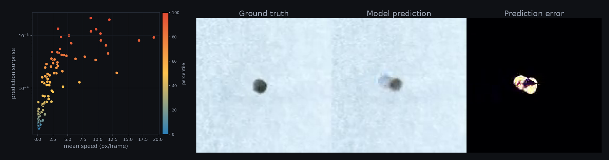

# Discovering Organoid Motility Variation Directly from Video

**ALife 2026** — Krishna Srinivasan, Kameron Bielawski, Douglas
Blackiston, Michael Levin, Joshua Bongard

## Abstract
Artificial Life investigators are interested in new forms of life. One route to achieve this is to reconfigure existing life forms, such as organoids. Motile organoids are of particular interest as they demonstrate that cellular coordination can arise within novel multicellular configurations — or survive reconfigurations — conferring, among other things, non-random motion upon the organoid as a whole. However, characterizing the diversity of behavior within such constructs is challenging. Current approaches require several manual steps, including feature engineering. Whether reliable motility differences across organoids can be recovered without presupposing features remains an open question. Here we show that an automated method can indeed discover features that most reliably distinguish organoids in their motility, directly from videos, as evidenced by agreement with the classical pipeline’s discovered features. The video prediction model driving the method generalizes to unseen organoid videos, establishing that organoid motility dynamics share common structure. Our approach thus enables scalable exploration of behavioral diversity across large video collections of motile organoids or other synthetic constructs, with little manual effort and without presupposing what to look for. 

## Videos

## Interactive explorer

**[kkannans.github.io/DiscoveringMotilityVariationDirectlyFromVideo](https://kkannans.github.io/DiscoveringMotilityVariationDirectlyFromVideo/)**
— click any of the 108 organoids to watch its model prediction versus ground truth and see how its
prediction surprise compares to the population.

## Code & reproduction
- **[SETUP.md](SETUP.md)** — install and run the full pipeline (segmentation, training, prediction
  surprise) for both the automated and classical methods.
- **[REPRODUCIBILITY.md](REPRODUCIBILITY.md)** — regenerate every paper figure from the released
  data, with the expected value for each.
- Data (108 videos + model weights + cached artifacts): `python download_data.py`
  (links in `data_manifest.json`).
- Model architectures (SimVP-TAU, PredRNN) are pinned via the `OpenSTL` submodule
  (`git submodule update --init`).

## Contact
Krishna.Kannan-Srinivasan@uvm.edu
